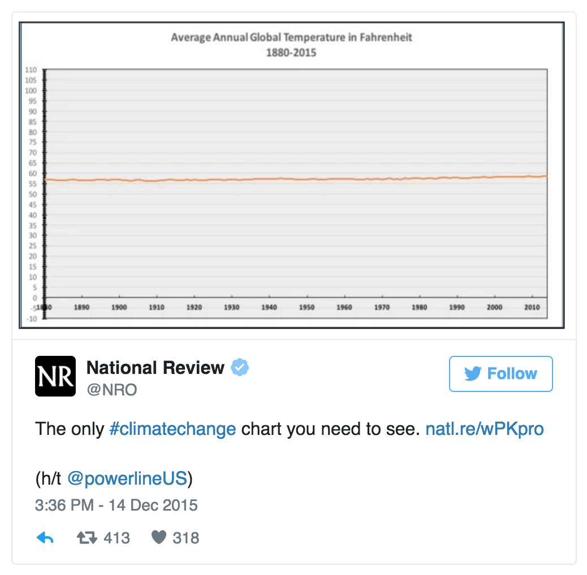
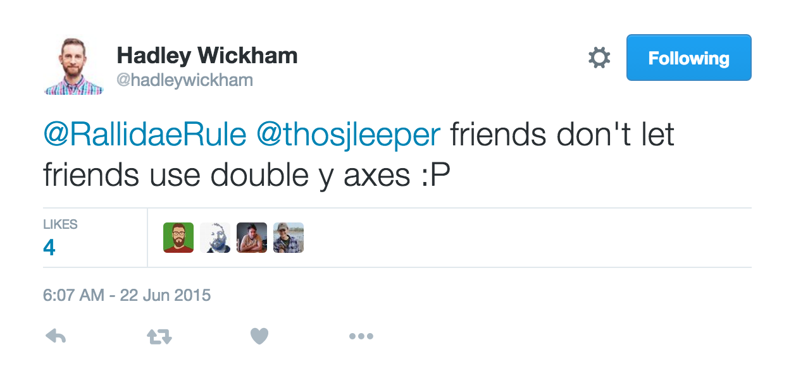
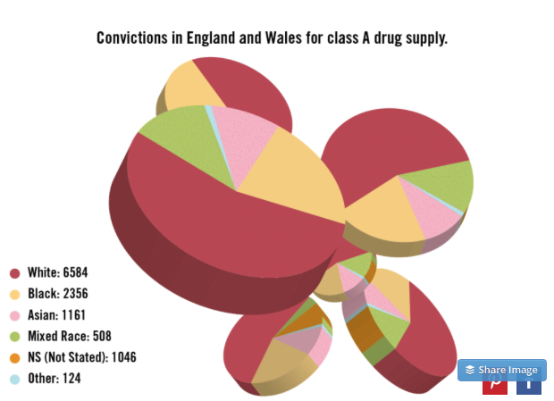
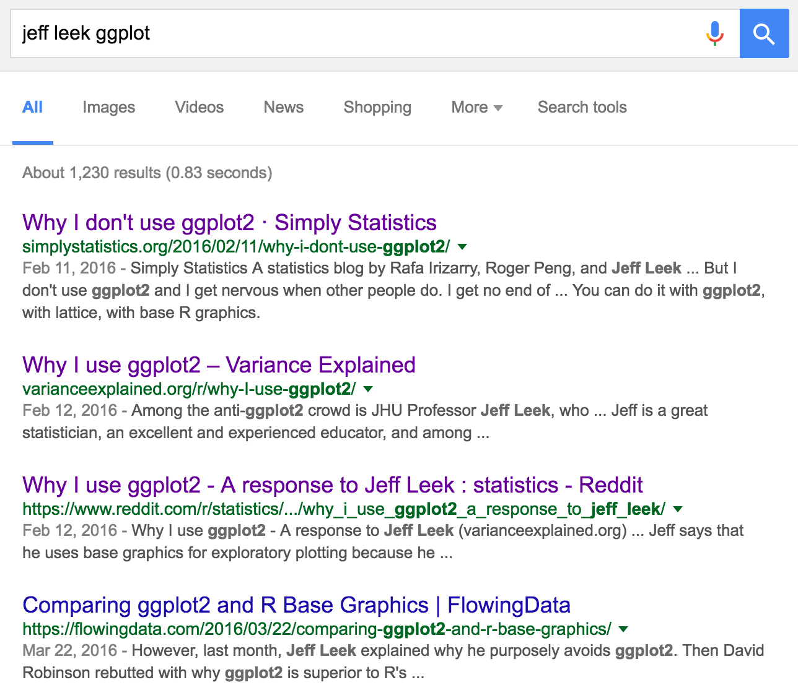
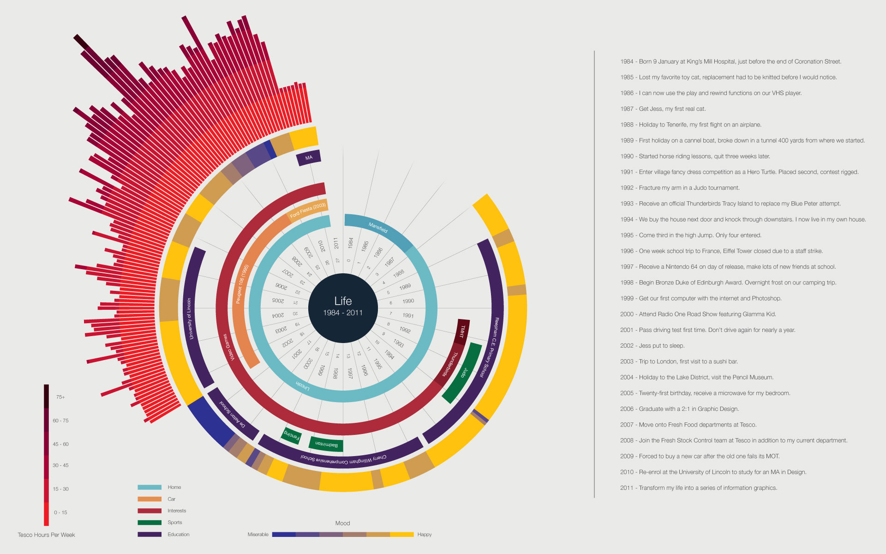
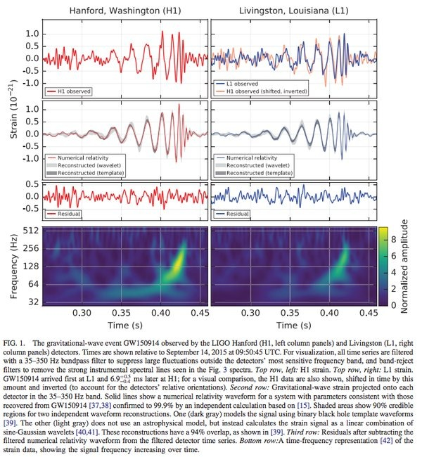

```{r setup, include=FALSE}
knitr::opts_chunk$set(echo = TRUE)
knitr::opts_chunk$set(fig.align = "center")
knitr::opts_chunk$set(message=FALSE)
```

---

## Outline

- [What to use?](#what-to-use)
- [Common Mistakes/fixes](#common-mistakes)
    - [Pie Charts](#pie-charts)
    - [Bar Charts](#bar-charts)
    - [Word Clouds](#word-clouds)
    - [Truncated Axes](#truncated-axes)
    - [Multiple Axes](#multiple-axes)
    - [Information Overload](#information-overload)
    - [The Third Dimension](#third-dimension)
- [Ggplot](#ggplot)
    - [Strengths](#strengths)
    - [Weaknesses](#weaknesses)
    - [Bottom Line](#summary)
- [New Tools/Libraries](#other_libraries)
    - [plotly](#plotly)
    - [html widgets](#html_widgets)
      - [Manhattan Plots](#manhattan_plot)
- [Complex Visualizations/Dashboards](#complex_viz)
    - [Ggpairs](#ggpairs)
    - [Plan Ahead](#requirements_analysis)
    - [Don't go crazy](#advice)
- [Beauty Vs. Clarity](#beauty_clarity)

---


# <a name="what-to-use"></a> What to use?

> "The best camera is the one that's with you." –Chase Jarvis.

A very common question for people starting out with R and visualization is "which library should I use?" Like most things there is no right answer. Every situation is different. I break it down to the following four points.

- Jeff Leek has a [fantastic article](http://simplystatistics.org/2016/02/11/why-i-dont-use-ggplot2/) on his blog about this issue.

- Ultimately it comes down to what you know. You can do an absolutely amazing amount in most tools ([even excel](http://www.excelcharts.com/blog/data-work-visualization-excel-users/)) so do what you like best.

- For most people in R the choice is Ggplot vs Base. I mostly use Ggplot because it's what I am the most familiar with (and it has nice defaults (more on this later)).

- Whatever you choose will, in the not to distant future, be old and replaced by the new best thing, so understanding the concepts is a much better investment of time. Let's try and go over those concepts by example.

---

# <a name="common-mistakes"></a>Common Mistakes

A lot of data visualization is common sense, but some of it isn't. These are a few examples of mistakes made very frequently by visualization practitioners.

## <a name="pie-charts"></a> The Pie Chart

Okay, let's get the elephant out of the room first. The pie chart elicits a similar response in a data-viz person as a computer scientist's prediction algorithm to a statistician. Initially claims of blaspheme but sometimes upon closer inspection begrudging respect.

Let's look at a simple example of one in R. 

```{r}
# a simple pie chart
data = data.frame(
  val  = c( 8 ,  6 ,  9 ,  4 ,  2 , 3.5),
  labs = c("a", "b", "c", "d", "e", "f") )

pie(data$val, data$labs)
```

That looks nice, so why all the ire?

Humans have a very hard time interpreting angles, and that's how a pie chart encodes its data. Looking at the code/chart above we know that `d` and `f` are 0.5 apart, or `f` is only 87.5% of the value of d, but upon initial inspection the average user would probably say they are the same.

So let's fix it.
```{r}
library(ggplot2)
ggplot(data, aes(y = val, x = labs)) + 
  geom_bar(stat = "identity")
```

Using a bar chart we can clearly see that f is smaller than d.

So is all the hate warranted?

Penn postdoc Randal Olsen has a good [blog post on pie charts.](http://www.randalolson.com/2016/03/24/the-correct-way-to-use-pie-charts/). It is a highly recommended read but to paraphrase his rules on pie charts:

1. The parts must sum to a meaningful whole. Always ask yourself what the parts add up to, and if that makes sense for what you’re trying to convey.
2. Try and collapse your categories down to three or fewer. Pie charts are bad at dealing with lots of proportions, so stick to their strengths and keep your pie charts simple. 
3. It doesnt hurt if the difference are larger and precision doesn't matter a ton. 
4. Always start your pie charts at the top. We naturally start reading pie charts at the top (the 0° mark). Don’t violate your reader’s expectations.

Pie charts fit into figures in space-constrained publications well and people intuitively get them so don't rule out their use entirely, but make sure you are using them properly.

---


##<a name="bar-charts"></a> When To Use a Bar Chart

Bar charts are fantastic tools. It seems that more often than not they are the best visualization for the job, often out-competing more complicated flashy visualizations in terms of ease of reading/comprehension. There are some instances where they are not appropriate however.

As a general rule of thumb, if the measure is a _quantity_ of something then it makes sense to use a bar chart. This would include number of infections, a person's weight etc...

In this example we will look at a group of students and their percentiles for seminar attendance.

First we plot with a bar plot.

```{r}
data = data.frame(student = c("Tina", "Trish", "Kevin", "Rebecca", "Nick"),
                  percentile = c(25, 95, 54, 70, 99)  ) #attendence percentile

plot = ggplot(data, aes(x = student, y = percentile))

plot + geom_bar(stat = "identity")
```

So the hierarchy of the data is clearly visible but the intuitive interpretation of the bar is slightly confusing. A percentile is not a sum of values but simply a place on the continuum of a scale. Let's re-do this as a dot-plot.

```{r}
# Hacking the geom_pointrange a bit so that the lines are the whole width.
plot + 
  geom_linerange(aes(ymin = 0, ymax = 100), alpha = 0.4) + 
  geom_point(color = "steelblue", size = 2) +
  coord_flip()
```

This is more legible and intuitive. We see that the measure is simply a point where the student falls, not the accumulation of percentiles.

There are some exceptions to this rule. For instance: weight being looked at for a single person over time might be best shown on a line chart. Like almost everything in visualization, thinking carefully about what your data are before plotting them is important.


---

## <a name="boxplots"></a> Box Plots

Box plots are, like the pie chart, one of the first visualization techniques we are taught. However, it is not neccesarily a good one and many better new options have arisen.

The problem with box plots is that they obscure trends more subtle than the quantiles.


## <a name="word-clouds"></a> Word Clouds

First we draw a traditional word cloud of the Bertrand Russell's "An Essay on the Foundations of Geometry"

```{r
library(tm)
library(SnowballC)
library(wordcloud)

setwd("data/")
Russell_Geom <- readChar("Russell_Geometry.txt", file.info("Russell_Geometry.txt")$size)
text_corpus <- Corpus(VectorSource(Russell_Geom)) #Generate a corpus
text_corpus <- tm_map(text_corpus, content_transformer(tolower))
text_corpus <- tm_map(text_corpus, removePunctuation) #remove punctuation
#Remove commonly used words that dont add meaning. (e.g. I, Me)
text_corpus <- tm_map(text_corpus, removeWords, stopwords('english'))
#Turn words into their stems (e.g. Running -> Run)
text_corpus <- tm_map(text_corpus, stemDocument)

wordcloud(text_corpus, max.words = 40, random.order = FALSE)
```

Ahh clearly we can grab very important information on the frequency of the words in this book...

Is "point" or "space" bigger? "Geometry" and "axiom"? Basically it's impossible.

Now let's do it in a bar chart.
```{r
dtm       <- DocumentTermMatrix(text_corpus)
dtm2      <- as.matrix(dtm)
frequency <- colSums(dtm2)
frequency <- sort(frequency, decreasing=TRUE)

#transform into a tidy dataframe like ggplot desires.
freq_df <- as.data.frame(frequency)
freq_df$word <-  rownames(freq_df)

#sort the data so ggplot respects the dataframe order
ggplot(freq_df[1:40,], aes(x = reorder(word, -frequency), y = frequency)) +
  geom_bar(stat = "identity") +  labs(x = "Word") + #use a barchart and label the xaxis
  theme(axis.text.x = element_text(angle = 40, hjust = 1)) # rotate the text so we can actually read the words
```

So while the bar chart might not be as flashy and cool, it certainly more accurately conveys the information you are trying to show.

That being said, if you are trying to simply make eye candy then go for the word cloud. However, if you are attempting to facilitate meaningful analysis, stick to a bar-chart.


---


## <a name="truncated-axes"></a>Trucated Axes

The re-arranging of an axis is one of the most potentially damaging forms of data visualization mistakes. By truncating an axis you can entirely change the interpretation of a chart. You can exaggerate a difference or minimize it. A good example of this done recently with potentially dangerous side effects is a tweet sent out by the magazine National Review.

<div style = "text-align: center;">

</div>

Look at that, we've all been getting way too worried about climate change! But wait, looks like they started their y-axis at 0. Seems like a good idea until you realize that 0 Fahrenheit means absolutely nothing. If you're going to start a temperature at 0 you might as well go all the way and do Kelvin.

Let's see an example of where truncating the axis _is_ bad.

```{r}
data = data.frame("date"  = c(2010, 2011, 2012, 2013),
                  "deaths"= c(400,  425,   430,  440))

plot <- ggplot(data, aes(x = date, y = deaths)) + geom_line() + theme_bw() + labs(title = "Hospital Deaths from 2010-2013")
plot

```

Oh my, looks like we've had a massive spike in hospital deaths.

Deaths however, are a measurement that has a meaningful start point (zero). So let's try and fix out axis scale to represent that.

```{r}
plot + ylim(0,450)
```

Turns out that was a false alarm (although still 40 more deaths might not be trivial).

__Important point:__ Ggplot automatically truncated the axis in this case. In a bar chart it wont let you set a non-zero axis without some esoteric scale commands but for many other plots (such as points and lines) it automatically truncates the axis so your data just fits in the limits. Be vigilant of this.


---


## <a name="multiple-axes"></a>Multiple Axes

<div style = "text-align: center;">

</div>

[_source_](http://www.tylervigen.com/spurious-correlations)

Continuing with our morbid theme by looking at Nicholas Cage movies, Tyler Vigen's [excelent site]((http://www.tylervigen.com/spurious-correlations)) on spurious-correlations illustrates our next point very well. When you make a chart with two different axis you can basically make the data say anything you want.

Duke Professor Kieran Healy sums this up very well in a blog post titled ["Two Y-Axes"](https://kieranhealy.org/blog/archives/2016/01/16/two-y-axes/).

<div style = "text-align: center;">

</div>
[_source_](https://kieranhealy.org/blog/archives/2016/01/16/two-y-axes/)

This also goes with the previous point of axes truncation. You can see that by changing axes you can very drastically change interpretations.

Ggplot doesn't even allow multiple axes at all as Hadley Wickham is strongly against the practice.

<div style = "text-align: center;">

</div>


---


## <a name="information-overload"></a> Information Overload

Say you have a lot of time series data. You might want to compare temporal trends in some measurement for patients in a clinical trial. One natural tendency might be to plot all of their values on the same plot, like below.

```{r}
library(reshape2)
line_data <- data.frame(x_val = 1:50)

for (letter in letters){
  slope = rnorm(1)
  line_data[,letter] <- sin(line_data$x_val + rnorm(1))*slope + rnorm(50)
}

#melt the big dataframe to a tidy one.
tidy_lines = melt(line_data, id = c("x_val"))

#plot with different lines for different letters.
#       data                               color code by letter    draw lines                     add a title
ggplot(tidy_lines, aes(x = x_val, y = value, color = variable)) + geom_line() + labs(title = "Delicious data spagetti")
```

Well this is a mess. You really can't tell what's going on in any way. If you want to see any trends or potential outliers you better be able to distinguish between the shade of green for k and i, and then be able to filter out all the noise and run 50 choose 2 comparisons in your head.

A way to get around this is using a technique known as small multiples. In small multiples you have a bunch of little tiny charts all with a single data element. So in this case it would be 50 separate line plots with one line each.

```{r}
#       data                                   draw lines     seperate charts by the letter           title it
ggplot(tidy_lines, aes(x = x_val, y = value)) + geom_line() + facet_wrap(~variable) + labs(title = "Small multiple lines")
```

As you can see, patterns are much easier to spot and outliers pop out immediately.

There is another method of dealing with this information overload. Say you have explored your data and want to highlight a single (or maybe two) value in the context of the others. You can highlight that individual line (or whatever graphical element you desire) to call attention to it alone in the chart. This is much more of an explanatory data visualization technique but it does work very well for showing context for an individual element.

```{r}
# cut our dataframe down to just the line we want to show:
z_line <- tidy_lines[tidy_lines$variable == "z", ]

#add the line like the first plot but make them all grey and semi-transparent
ggplot(tidy_lines) + geom_line(aes(x = x_val, y = value, group = variable),color = "grey", alpha = 0.7) +
  labs(title = "Highlighted line") + #Now add a second data element with just highlighted line
  geom_line(data = z_line, aes(x = x_val, y = value, group = variable), color = "steelblue")
```


---


## <a name="third-dimension"></a> The Third Dimension!

3d charts are cool and very tempting to make, but they are fraught with all sorts of problems. The main one being that perspective (literally) matters. Just like real life, stuff looks bigger the closer it is, so unless your viewer is going to be viewing your visualization on an oculus rift with stereo 3d you should stick to two dimensions. That being said, per usual, there are some ways around this that are acceptable.

With that I give you potentially the worst data visualization ever created:

<div style = "text-align: center;">

</div>

[_source_](http://viz.wtf/)

As we already talked about pie charts are dangerous as slices with different values can look very similar. Once you take that and add in the perspective skewings of the third dimension you get a perfect storm of misleading. I have no suggestions on how to fix this as there are none. Just don't do it. (But later on I will demonstrate an example of when you can use a 3d visualization and be mostly okay.)

---

# <a name="ggplot"></a> Ggplot

While R vs. Python is a heated battle in the statistics community, a much more vitriolic battle is waged on the R sideline over plotting vs base graphics. Jeff Leek's aforementioned article, while written in a tone calling for understanding on the two sides simply ignited passions to hereto unseen levels.  

<div style = "text-align: center;">

</div>

Ultimately (I get to make this final decision) ggplot has its positives and negatives.

## <a name="strengths"></a>Strengths

- __Has fantastic defaults__

It is pretty dang hard to make a plot with ggplot that looks bad. Base graphics? Pretty easy. This is good as it has helped many people put out better graphics than they otherwise would have.

- __Grammar of Graphics__

the "gg" in ggplot stands for grammar of graphics which is a framework for plotting developed by Leland Wilkinson in his book [The Grammar of Graphics.](http://www.amazon.com/Grammar-Graphics-Statistics-Computing/dp/0387245448) The basic tenants behind this methodology are that you start with your data, and then you assign a geometry to elements of that data, such as circle size to population, then you draw those geometries based upon some scaling of your data. When you think about visualization this way it helps you develop a better understanding of the data itself and think of proper ways to visualize it. (Think the bar vs dot chart.)

- __Verbose__

Due to the grammar of graphics aspect ggplot is rather intelligible. For instance, while writing a line chart takes more characters of code than it does in base graphics it tends to be much clearer what is going on.

```{r, eval=FALSE}
#base graphics
plot(x = df$date, y = df$weight, type = "l", col = "blue")

##ggplot
ggplot(data = df, aes(x = date, y = weight)) + geom_line(color = "blue")
```

Is `col` columns? `type` also seems rather esoteric and would require looking up definitions. In ggplot you can see what x is mapping to, what y is mapping to in your data, `geom_line` is rather clear that it's drawing a line and coloring it blue.

This is important for sharing code with potentially less fluent coders.  

## <a name="weaknesses"></a>Weaknesses

- __Slow__

It generally takes a good bit of time to construct a ggplot graphic. Base allows you to rapidly get a plot up and running. For instance if you want to check if your simulation is running properly or if something interesting is happening in your data a quick `plot(x,y)` is usually more than enough. It doesn't need to look pretty for you.

- __Limitated functionality__

Want to plot a bunch of different charts on a single plot? With ggplot the charts generated with `facet` have to be of the same geometry. If you want to put together a line and bar plot you need to use another library called `grid` which is a pain, especially considering that it's a single simple command in base (`par(mfrow = c(a,b))`).

## <a name="summary"></a>Summary

Like I said at the beginning of this document, choose your plotting library and then apply the above principles within it. Very rarely will you need to jump to a whole different library to do something. If you do, that's why stackoverflow was invented. #

---

# <a name="other_libraries"></a>Other Plotting Libraries

## <a name="plotly"></a>Plotly

```{r, echo=FALSE}
x <- rnorm(20)
#Function for likelihood
normalLikelihood <- function(x, mu, sigma_2){
  n <- length(x)
  ( (2 * pi * sigma_2)^(-n/2) ) * exp( (-1/(2*sigma_2)) * sum( (x - mu)^2 ))
}

#values to loop over.
mus = seq(mean(x) - 1.5,mean(x) + 1.5, length.out = 500)
sigma_2s = seq(0.001, var(x) + 1.5, length.out = 500)

#how to find where you are on the matrix for grabbing of values.
mu_pos      <- function(i, length){ ( (i-1) %% length ) + 1 }
sigma_2_pos <- function(i, length){ floor((i-1)/length) + 1}

#need how many mus we are looking at.
muLength = length(mus)

likelihoodMat = function(i){
  mu      = mus[mu_pos(i, muLength)]
  sigma_2 = sigma_2s[sigma_2_pos(i, muLength)]
  normalLikelihood(x, mu, sigma_2)
}

#generate the position itterator.
pos = 1: (length(mus)*length(sigma_2s))

results <- sapply(pos, likelihoodMat)

#normalize
newRes = results/max(results)

#make it into a matrix
resMat = matrix(newRes, nrow = muLength)
colnames(resMat) = sigma_2s
rownames(resMat) = mus
```

This is a plotting library that allows you to generate interactive plots directly from R. It does this by rendering them in JavaScript (using a technique we will see shortly).

One beautiful thing about plotly is the ability to export ggplot objects directly to it.

```{r}
library(plotly)

#grab some of R's built in data.
d <- diamonds[sample(nrow(diamonds), 1000), ]

#generate a ggplot object
p <- ggplot(data = d, aes(x = carat, y = price)) +
  geom_point(aes(text = paste("Clarity:", clarity)), size = 2) +
  geom_smooth(aes(colour = cut, fill = cut)) + facet_wrap(~ cut)

#send it to plotly to recreate
ggplotly(p)
```

Now our normal ggplots can have interactivity which can be absolutely fantastic for exploring outliers/presenting data in an engaging way.

Plotly is not limited simply to re-rendering ggplot. It is capable of rendering three-dimensional and/or high performance visualizations using the same engine that video games use.

In the next example `z` is a matrix of data corresponding to a two parameter normal likelihood. We pass it to plotly and tell it to draw a surface plot and ...

```{r, eval=FALSE}
plot_ly(z = resMat, type = "surface")
```

```{r, echo=FALSE}
plot_ly(z = resMat, type = "surface")
```

...pretty cool.

Sometimes a 3d visualization is absolutely necessary (by the data or choice), in these instances you pretty much need the visualization to be interactive (or at least animated) to allow the user to be able to explore the 3d space in order to eliminate the biases injected by perspective.


---

## <a name="html_widgets"></a>HTML-Widgets

An R library that allows you to bind R with JavaScript. Now that much of R is done in rmarkdown notebooks (like this one) and in shiny applications there is a huge potential for interactivity. We have already seen one of these in plotly above but anyone can make them and many have.

Check out the [html widgets showcase](http://www.htmlwidgets.org/showcase_leaflet.html) to see some of the currently made packages. The process for [making one yourself](http://www.htmlwidgets.org/develop_intro.html) is "simple", it's just like making a standard r package except there is also a JavaScript section. JavaScript though is rather... fun.

<a name="manhattan_plot"></a>
I have made a simple htmlwidget library for displaying gwas results and have it hosted on github [here.](https://github.com/nstrayer/D3ManhattanPlots)

```{r}
# library(devtools)
# install_github("nstrayer/D3ManhattanPlots")
library(manhattanPlot) #no idea why I named it different than the repo name

#Load in package data to test.
d = sampleVals

#Draw it!
manhattanPlot(d)  
```

Htmlwidgets are very valuable if you have a particular chart you need to make all the time that would benefit from interactivity and isn't a standard plot like those supported in plotly. More and more researchers are [publishing interactive online visualizations](http://danlarremore.com/faculty/) to go along with their papers and the combination of rmarkdown and htmlwidgets makes this very straightforward. No server needed, simply plop the html page generated by a markdown file anywhere and you're good to go.

__Note:__ If you have something that falls into this category and aren't comfortable with JavaScript visualization, get in contact with me. I never turn down an opportunity to make cool visualizations.


---

# <a name="complex_viz"></a>Complex Visualizations

More often than not it is better to keep your visualization simple. However, sometimes it is helpful and or necessary to generate complex visualizations or interactive dashboards. If you have a figure limit for a journal or assignment cramming as much information into a single pane can be very valuable.

## <a name="ggpairs"></a>Ggpairs

There are some methods of doing this with R. Most notable would be making a shiny app with multiple plotting panes. In addition there are some nice packages such as `GGally` which contain functions like `ggpairs` which is a souped-up scatter matrix with a bunch of extra information.

```{r}
library(GGally)
data(tips, package = "reshape")
pm <- ggpairs(tips, columns = c(1, 6, 2, 3))

# we have to supress some dumb binwidth warnings that we cant fix because this is a wrapper function.
suppressMessages(print(pm))
```

## <a name="my_stuff"></a>Home Grown Artisan Visualizations

These are some examples of more complex and interactive visualizations I have built for statistics-related applications.

- [Confidence Interval Coverage](http://nickstrayer.me/binomialFun/confidenceIntervals)
- [Likelihood Functions](http://nickstrayer.me/likelihood)

## <a name="requirements_analysis"></a>Requirements Analysis

A technique used in software engineering frequently that can be very valuable when designing a complex visualization piece is something know as [requirements analysis.](https://en.wikipedia.org/wiki/Requirements_analysis) Briefly put: the act of sitting down before starting and thoroughly sketching out exactly what you need and want out of the visualization so you don't waste time in the coding process by backtracking.

## <a name="advice"></a>Words To the Wise

Don't go nuts. Most likely the user will not understand the data you are showing at nearly the level you do so something that may seem intuitive to you very well be entirely unintelligible to them.

---

# <a name="beauty_clarity"></a>Beauty Vs. Clarity

A frustratingly qualitative issue in visualization is the role of beauty. Some people such as Edward Tufte are very strict on the matter. Stating that no "chart junk" should clutter your visualization. Basically that only precisely what is necessary to convey the data should be plotted, nothing more. This is very true and most likely the best practice for scientific articles, but many times beauty is a tool for comprehension as well.

If a plot is beautiful the viewer is more likely to stick with it, to investigate it and explore the data within. There is a field of psychology known as [the generation effect](https://en.wikipedia.org/wiki/Generation_effect) which describes how people remember things better that the explore and explain to themselves. If you data is super clearly displayed then the user might simply see it but never remember it.

Take for example the following two visualizations. One is beautiful but certainly doesn't convey the underlying data in the most straightforward way, where as the second is pretty spartan but the data is more than clear. Which one would you spend more time looking at (assuming you're not a physicist)?

<div style = "text-align: center;">
  
  
</div>
